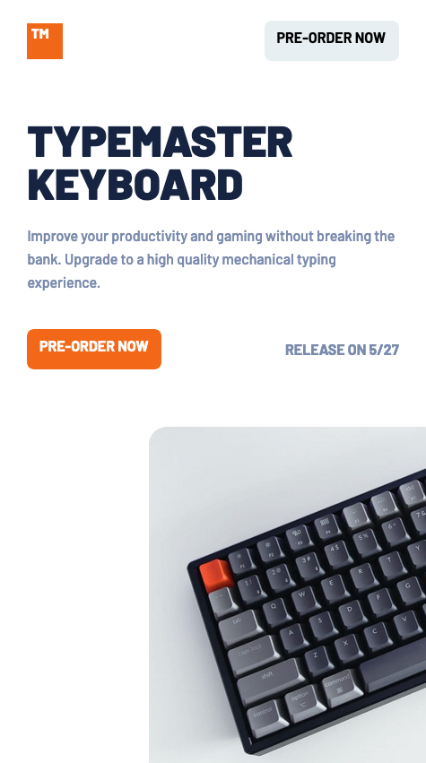

# Frontend Mentor - Typemaster pre-launch landing page solution

This is a solution to the [Typemaster pre-launch landing page challenge on Frontend Mentor](). Frontend Mentor challenges help you improve your coding skills by building realistic projects.

## Table of contents

- [Frontend Mentor - Typemaster pre-launch landing page solution](#frontend-mentor---typemaster-pre-launch-landing-page-solution)
  - [Table of contents](#table-of-contents)
  - [Overview](#overview)
    - [The challenge](#the-challenge)
    - [Screenshot](#screenshot)
    - [Links](#links)
  - [My process](#my-process)
    - [Built with](#built-with)
    - [What I learned](#what-i-learned)
    - [Continued development](#continued-development)
    - [Useful resources](#useful-resources)
  - [Author](#author)

## Overview

### The challenge

Users should be able to:
- View the optimal layout depending on their device's screen size
- See hover states for interactive elements

### Screenshot

### Links

- Solution URL: [https://github.com/norman02/typemaster-prelaunch-page.git](https://github.com/norman02/typemaster-prelaunch-page.git)
- Live Site URL: [https://typemaster-prelaunch-page.vercel.app/](https://typemaster-prelaunch-page.vercel.app/)

## My process

### Built with

- Semantic HTML5 markup
- CSS Grid
- Mobile-first workflow
- 7-1 Pattern
- [Sass] (https://sass-lang.com/) - CSS framework

### What I learned

This was a bit of a layout challenge. Particularly dealing with the "wings" in the margins on desktop view. I'm still not entirely happy with the responsiveness in these sections. This project was great practice for grid layout.

I found it necessary to modify some of the provided artwork. The .svgs had extra white space that made layout difficult. I used Adobe Illustrator to fix the svgs. 

### Continued development

This project has convinced me I need some more practice with css grid.

### Useful resources

- [CSS-Tricks](https://css-tricks.com/snippets/css/complete-guide-grid/) - I used this site to figure out grid layout for this project. This site is a great resource for any CSS question.

## Author

- Frontend Mentor - [@norman02](https://www.frontendmentor.io/profile/norman02)
- Twitter - [@JohnIsNorman](https://www.twitter.com/JohnIsNorman)

